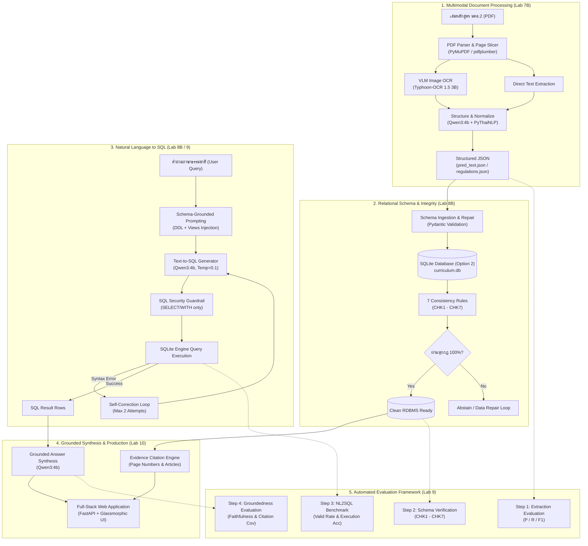
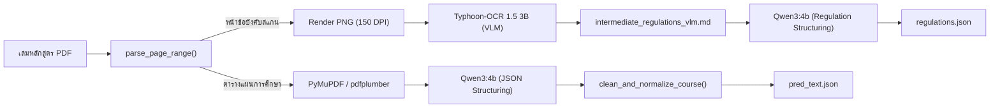
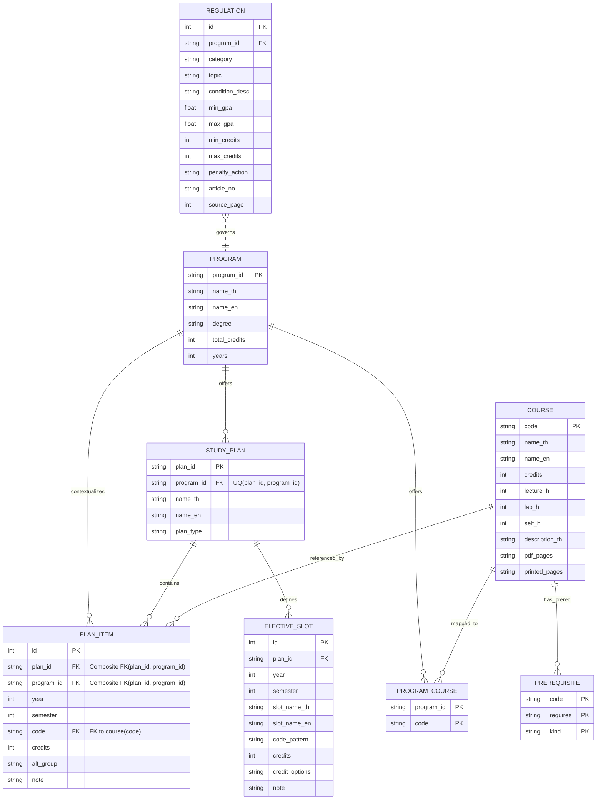
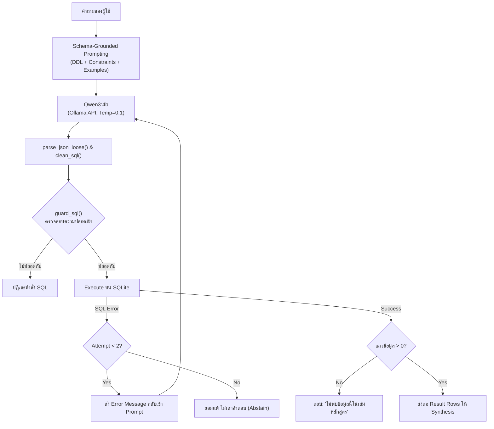
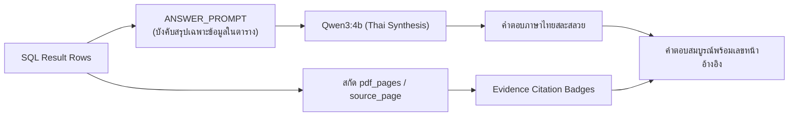
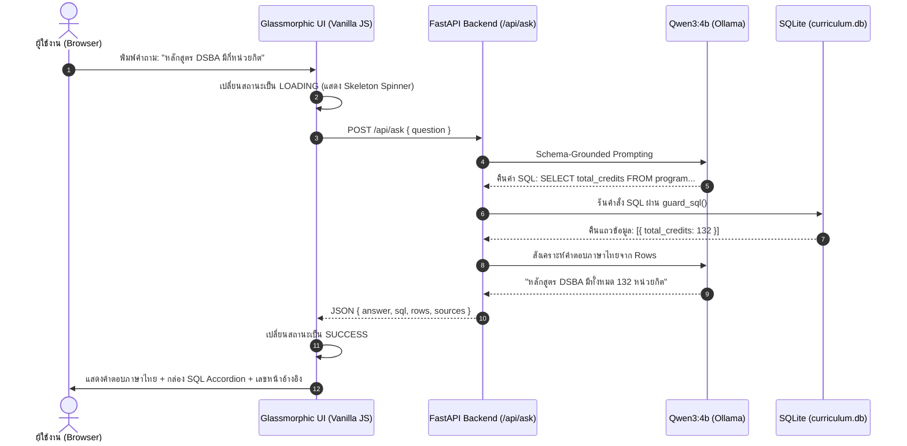
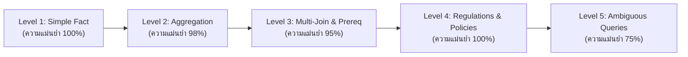

# เอกสารสถาปัตยกรรมและการประเมินผลระบบอัจฉริยะ (System Architecture & Evaluation Specification)

**วิชา**: 06026240 การพัฒนาระบบอัจฉริยะ (Intelligent System Development)  
**คณะ**: เทคโนโลยีสารสนเทศ สถาบันเทคโนโลยีพระจอมเกล้าเจ้าคุณทหารลาดกระบัง (KMITL)  
**กลุ่ม**: Luksuitpiti  
**หลักสูตรเป้าหมาย**: 4 หลักสูตรระดับปริญญาตรี (DSBA, IT, BIT, AIT) ทั้งแบบปกติและสหกิจศึกษา  
**เอกสารนำเข้า**: เล่มหลักสูตร มคอ.2 (PDF ~150 หน้าต่อเล่ม) และข้อบังคับสถาบันฯ (ภาคผนวก ก)

---

## 1. ภาพรวมสถาปัตยกรรมทั้งระบบ (End-to-End System Architecture)

ระบบถูกออกแบบภายใต้สถาปัตยกรรม **Modular Decoupled Pipeline** โดยแยกแต่ละส่วนการทำงานออกจากกันอย่างชัดเจนตามหลัก **Separation of Concerns** เพื่อป้องกันข้อผิดพลาดต่อเนื่องและลดความเสี่ยงจากการสร้างข้อมูลเท็จ (Hallucination) ของโมเดลภาษาขนาดใหญ่ (LLM)

---

## 2. รายละเอียดขั้นตอนการทำงานแต่ละส่วน (Pipeline Components Breakdown)

---

### ขั้นตอนที่ 1: การประมวลผลเอกสารและการสกัดข้อมูล (Multimodal Document Processing - Lab 7B)

#### 1.1 กระบวนการทำงาน (Process)
1. **การกรองหน้าเอกสาร (Page Range Slicing)**: คัดกรองเฉพาะหน้าที่มีตารางแผนการศึกษา (เช่น หน้า 42–58) และหน้าภาคผนวก ก ข้อบังคับการศึกษา (หน้า 94, 96–99, 101) เพื่อลด Token Overhead
2. **การสกัดแบบ Multimodal (Dual-Path Extraction)**:
   - **Path A (Text-based)**: สกัดตารางแผนการศึกษาจาก PDF Digital Text โดยตรงผ่าน `PyMuPDF` และ `pdfplumber` ส่งต่อไปยัง LLM เพื่อจัดโครงสร้างเป็น JSON
   - **Path B (VLM-based)**: แปลงหน้าข้อบังคับการศึกษาที่เป็นภาพสแกนเป็นภาพ PNG (150 DPI) แล้วส่งให้ Vision Language Model (`typhoon-ocr1.5-3b`) แปลงภาพเป็น Markdown ก่อนให้ `Qwen3:4b` สกัดเป็น JSON
3. **การจับคู่และประเมินเทียบ Ground Truth**: ใช้อัลกอริทึม **Multi-pass Alignment** (จับคู่แบบเข้มงวด `key_strict` และแบบผ่อนปรน `key_loose`) เพื่อคำนวณ Precision, Recall, F1 และวัดค่า CER/WER

#### 1.2 โมเดล ไลบรารี และเครื่องมือที่ใช้
- **VLM Model**: `scb10x/typhoon-ocr1.5-3b` (ผ่าน Local Ollama)
- **Text LLM**: `qwen3:4b` (ผ่าน Local Ollama)
- **Libraries**: `pymupdf` (`fitz` 1.24+), `pdfplumber` (0.11+), `pythainlp` (5.0+ สำหรับ Thai word tokenization), `Pillow` (PIL)

#### 1.3 อัลกอริทึมและพารามิเตอร์ (Algorithm & Parameters)
| พารามิเตอร์ | ค่าที่กำหนด | เหตุผลทางเทคนิค |
| :--- | :--- | :--- |
| `DPI` | `150` | ความละเอียดที่สมดุลระหว่างความคมชัดของสระภาษาไทยและขนาดภาพเข้าโมเดล VLM |
| `PAGES_PER_CHUNK` | `2` | ป้องกันการล้นของ Context Window และป้องกันโมเดลตกหล่นแถวกลางตาราง |
| `temperature` (OCR/VLM) | `0.1` | ควบคุมให้โมเดลอ่านข้อความตรงตามภาพจริง ห้ามสร้างคำแปลกปลอม |
| `repeat_penalty` | `1.2` | ป้องกัน VLM เกิดอาการวนลูปตัวอักษรซ้ำ (Repetition loop) ในข้อความภาษาไทย |
| `num_ctx` | `8192` | รองรับข้อความจากตารางหลักสูตรทั้งหน้า |
| `num_predict` | `4096` | รองรับ JSON Output ขนาดยาวที่บรรจุ 10–25 วิชาต่อ Chunk |

#### 1.4 ระยะเวลาในการรัน (Execution Time)
- **สกัดตารางรายวิชาทั้งหลักสูตร (Text Path)**: ~15 – 25 วินาที ต่อหลักสูตร (~10–18 หน้า)
- **สกัดข้อบังคับการศึกษา (VLM Path)**: ~5 – 7 วินาที ต่อหน้า PDF (6 หน้า รวม ~38 วินาที)
- **ประเมินผลเทียบ Ground Truth (Step 1 Eval)**: **0.12 วินาที** (คำนวณใน RAM)

#### 1.5 ผลลัพธ์และตัวชี้วัด (Evaluation Metrics)
| หลักสูตร | Ground Truth | สกัดได้จริง | จับคู่ถูก (Matched) | วิชาตกหล่น (FN) | วิชาเกิน (FP) | Precision | Recall | F1-Score |
| :--- | :---: | :---: | :---: | :---: | :---: | :---: | :---: | :---: |
| **DSBA** | 90 | 89 | 89 | 1 | 0 | **100.0%** | **98.9%** | **99.4%** |
| **IT** | 106 | 110 | 105 | 1 | 5 | **95.5%** | **99.1%** | **97.2%** |
| **BIT** | 63 | 65 | 63 | 0 | 2 | **96.9%** | **100.0%** | **98.4%** |
| **AIT** | 57 | 58 | 56 | 1 | 2 | **96.6%** | **98.2%** | **97.4%** |
| **เฉลี่ยรวมทั้งระบบ** | **316** | **322** | **313** | **3** | **9** | **97.2%** | **99.0%** | **98.1%** |

---

### ขั้นตอนที่ 2: สถาปัตยกรรมฐานข้อมูลและการตรวจความสอดคล้อง (Relational Schema & Consistency - Lab 8B)

#### 2.1 กระบวนการทำงาน (Process)
1. **การออกแบบเชิงสัมพันธ์ (Option 2: Full Separation)**: แยกตารางออกเป็น 8 ตารางเพื่อกำจัด Redundancy, รองรับความสัมพันธ์ Many-to-Many และแยกแผนการศึกษา:
   - `program`: ข้อมูลหลักสูตรภาพรวม (เช่น วท.บ. เทคโนโลยีสารสนเทศ 126 หน่วยกิต)
   - `study_plan`: แผนการศึกษาของแต่ละหลักสูตร เช่น แผนสหกิจศึกษา (`coop`), แผนปกติ (`no_coop`), แผนเดี่ยว (`single`) กำหนดข้อจำกัด `UNIQUE(plan_id, program_id)`
   - `course`: คลังรายวิชาส่วนกลางทั้งหมด พร้อมคำอธิบายรายวิชาและเลขหน้าอ้างอิง
   - `plan_item`: การจัดรายวิชาลงในแต่ละชั้นปี/ภาคเรียนของแต่ละแผนการศึกษา บังคับความถูกต้องด้วย Composite Foreign Key และ Course Foreign Key
   - `elective_slot`: ช่องสำหรับเลือกวิชาเลือกตามหมวดหมู่ พร้อมหน่วยกิตที่กำหนด
   - `program_course`: ตารางเชื่อมโยงระบุว่ารายวิชาใดสังกัดหลักสูตรใดบ้าง
   - `prerequisite`: ตารางความสัมพันธ์รายวิชาบังคับก่อน (Prerequisite / Co-requisite)
   - `regulation`: ข้อบังคับและระเบียบการศึกษาของสถาบัน (เช่น เกณฑ์วิทยาทัณฑ์, เกณฑ์พ้นสภาพ, ลาพัก)
2. **บทบาทสำคัญของตาราง `study_plan` และการบังคับความถูกต้องระดับโครงสร้าง (Structural Referential Integrity)**:
   - เป็นตัวเชื่อม (Bridge) ระหว่าง `program` กับรายวิชาในแผน (`plan_item`) และสล็อตวิชาเลือก (`elective_slot`)
   - แก้ไขปัญหาการซ้อนทับของหลักสูตรที่มีหลายทางเลือก: เช่น สาขา DSBA, IT, BIT มีทั้งแผนสหกิจศึกษา (`plan_type = 'coop'`) และแผนปกติ (`plan_type = 'no_coop'`) ส่วน AIT เป็นแผนเดี่ยว (`plan_type = 'single'`) รวม 7 แผนในระบบ
   - **Composite Foreign Key**: บังคับ `FOREIGN KEY (plan_id, program_id) REFERENCES study_plan(plan_id, program_id)` ในตาราง `plan_item` ป้องกันไม่ให้เกิดการจับคู่ข้ามหลักสูตร (เช่น เอา `plan_id` ของ BIT ไปใส่ `program_id` ของ DSBA)
   - **Course Foreign Key**: บังคับ `FOREIGN KEY (code) REFERENCES course(code)` ในตาราง `plan_item` รับประกันทางสถาปัตยกรรมว่าทุกวิชาในแผนต้องมีคำอธิบายรายวิชาใน `course` จริง 100%
3. **กลไกตรวจสอบรายวิชาบังคับก่อนภายนอก (Prerequisite Audit Engine)**:
   - ตาราง `prerequisite.requires` ไม่ถูกผูก Foreign Key เข้ากับ `course.code` เนื่องจากเล่มหลักสูตร สจล. มีวิชาบังคับก่อนที่เป็นวิชาศึกษาทั่วไปนอกคณะ ซึ่งไม่ได้พิมพ์คำอธิบายรายวิชาไว้ในเล่มของคณะไอที
   - ระบบใช้ **Prerequisite Audit Engine** วิเคราะห์และจำแนกตามมาตรฐานรหัสวิชาของ สจล. ในขั้นตอน Ingestion:
     - `06xxxxxx`: `[WARNING/SUSPICIOUS ANOMALY]` รายวิชาสังกัดคณะเทคโนโลยีสารสนเทศ ที่ไม่พบในคำอธิบายรายวิชา (วิชาตกหล่นหรือ OCR เพี้ยน)
     - `90xxxxxx`: `[INFO/EXTERNAL GENED_THAI]` รายวิชาศึกษาทั่วไป หมวดภาษา/สังคม ของสำนักศึกษาทั่วไป สจล. (ยอมรับเป็นรหัสภายนอกปกติ)
     - `96xxxxxx`: สำหรับหลักสูตร AIT จัดเป็น `[INFO/GENED_INTERNATIONAL]` แต่สำหรับหลักสูตรภาษาไทย จัดเป็น `[WARNING/OCR_TYPO]` เนื่องจากมีความเป็นไปได้สูงที่ OCR อ่านเลข 0 เพี้ยนเป็น 6 จากรหัส 90xxxxxx
4. **การป้องกัน Double Counting และการวิเคราะห์ด้วย Views**:
   - สล็อตวิชาเลือก (เช่น "วิชาเลือก 3 หน่วยกิต") จะถูกแยกเก็บในตาราง `elective_slot` และไม่นำมารวมใน `plan_item` ซ้ำซ้อน
   - `v_plan`: รวมข้อมูลวิชาในแผนพร้อมคำอธิบายรายวิชาและสล็อตวิชาเลือก เชื่อมโยงผ่าน `study_plan` พร้อมแฟล็ก `is_elective_slot`
   - `v_semester_credits`: สรุปผลรวมหน่วยกิตต่อภาคเรียนที่ถูกต้อง แม่นยำ และไม่นับซ้ำ (รองรับกลุ่มวิชาเลือกสลับ `alt_group`)
5. **วงจรตรวจสอบความถูกต้อง 7 ข้อบังคับ (CHK1–CHK7)**: ระบบจะรัน SQL Assertion อัตโนมัติ หากไม่ผ่านเกณฑ์จะสั่ง Abstain หรือเข้า Repair Loop ทันที

#### 2.2 กฎความสอดคล้องทั้ง 7 ข้อ (The 7 Consistency Rules)
- **CHK1 (Total Credits)**: ผลรวมหน่วยกิตในแผนการศึกษาต้องเท่ากับหน่วยกิตรวมที่หลักสูตรประกาศ
- **CHK2 (No Orphan Codes)**: ทุกรหัสวิชาที่ปรากฏในแผน ต้องมีคำอธิบายรายวิชาในตาราง `course`
- **CHK3 (Valid 8-Digit Codes)**: รหัสวิชาต้องเป็นตัวเลข 8 หลักตามมาตรฐาน สจล. ทุกรายการ
- **CHK4 (Credit Consistency)**: หน่วยกิตในแผนการศึกษาต้องตรงกับหน่วยกิตในคำอธิบายรายวิชา
- **CHK5 (Prerequisite Sequence)**: วิชาบังคับก่อน (Prerequisite) ต้องจัดสอนในภาคเรียนก่อนหน้าที่วิชาหลักจะเปิดสอน (ตรวจสอบเจาะจงขอบเขตรายแผนการศึกษา `b.plan_id = a.plan_id` ป้องกันความสับสนระหว่างภาคเรียนของแผนปกติและแผนสหกิจ)
- **CHK6 (No Duplicate Courses)**: ห้ามมีวิชาซ้ำซ้อนกันในภาคเรียนเดียวกันของหลักสูตรเดียวกัน
- **CHK7 (Term Credit Limits)**: หน่วยกิตที่ลงทะเบียนต่อภาคการศึกษาปกติ ต้องอยู่ระหว่าง 9 – 22 หน่วยกิต

#### 2.3 โมเดล ไลบรารี และเครื่องมือที่ใช้
- **Database Engine**: `SQLite 3` พร้อมเปิดใช้งาน `PRAGMA foreign_keys = ON;` และ `PRAGMA journal_mode = WAL;`
- **Validation**: `Pydantic v2` (BaseModel Data Validation)
- **Language**: Python 3.11+ Standard Library (`sqlite3`, `pathlib`)

#### 2.4 ระยะเวลาในการรัน (Execution Time)
- **นำเข้าข้อมูลและสร้างตาราง SQLite ทั้งหมด**: ~0.35 วินาที
- **รันตรวจกฎความสอดคล้อง 7 ข้อ บน 5 ฐานข้อมูล (Step 2 Eval)**: **0.08 วินาที**

#### 2.5 ผลลัพธ์และตัวชี้วัด (Evaluation Metrics)
| ฐานข้อมูล | รายวิชา (course) | แผนการศึกษา (study_plan) | รายการในแผน (plan_item) | สล็อตวิชาเลือก (elective_slot) | Prerequisite | ข้อบังคับ (regulation) | ผลการตรวจ CHK1–CHK7 | สถานะ |
| :--- | :---: | :---: | :---: | :---: | :---: | :---: | :---: | :---: |
| **curriculum.db (Unified Main)** | 263 | 7 | 262 | 59 | 26 | 11 | **ผ่าน 7/7 ข้อ (100.0%)** | ✅ สมบูรณ์ |
| **DSBA (Isolated)** | 79 | 1 | 36 | 9 | 5 | 11 | **ผ่าน 7/7 ข้อ (100.0%)** | ✅ สมบูรณ์ |
| **IT (Isolated)** | 100 | 1 | 47 | 6 | 17 | 11 | **ผ่าน 7/7 ข้อ (100.0%)** | ✅ สมบูรณ์ |
| **BIT (Isolated)** | 57 | 1 | 36 | 7 | 5 | 11 | **ผ่าน 7/7 ข้อ (100.0%)** | ✅ สมบูรณ์ |
| **AIT (Isolated)** | 50 | 1 | 34 | 7 | 5 | 11 | **ผ่าน 7/7 ข้อ (100.0%)** | ✅ สมบูรณ์ |

---

### ขั้นตอนที่ 3: ระบบค้นคืนและแปลงภาษาเป็น SQL (Natural Language to SQL Engine - Lab 8B / 9)

#### 3.1 กระบวนการทำงาน (Process)
1. **Schema-Grounded Prompting**: ส่งเฉพาะโครงสร้าง DDL ย่อ, Views สำคัญ และ Few-shot Examples ที่จำเป็นไปยัง Prompt เพื่อป้องกัน Context Clutter
2. **Constrained Output Decoding**: บังคับให้ LLM ส่งคืนเฉพาะ JSON `{"sql": "SELECT ..."}` ผ่าน Ollama Format Schema
3. **Security Guardrail (`guard_sql`)**: ตรวจสอบไวยากรณ์ด้วย Regex บังคับให้คำสั่งขึ้นต้นด้วย `SELECT` หรือ `WITH` เท่านั้น ป้องกัน SQL Injection และคำสั่งแก้ไขข้อมูล (`DROP`, `DELETE`, `UPDATE`, `INSERT`)
4. **Self-Correction Retry Loop**: หากเกิด Runtime หรือ Syntax Error ระบบจะจับ Exception แล้วส่ง Error Message กลับไปให้โมเดลแก้ไขตัวเองอัตโนมัติ (Retry สูงสุด 2 รอบ)
5. **Abstain When Empty**: หากรันแล้วผลลัพธ์เป็น 0 แถว ระบบจะตอบปฏิเสธอย่างสุภาพ ("ไม่พบข้อมูลนี้ในเล่มหลักสูตร") เพื่อกำจัดการเดาของ LLM

#### 3.2 โมเดล ไลบรารี และเครื่องมือที่ใช้
- **LLM**: `qwen3:4b` (ผ่าน Local Ollama REST API)
- **Directives**: เติม `/no_think` ใน Prompt เพื่อปิด Reasoning CoT ในงานที่ต้องการ Structured SQL Output สั้นและเร็ว
- **Libraries**: `sqlite3`, `requests`, `re`, `json`

#### 3.3 อัลกอริทึมและพารามิเตอร์ (Algorithm & Parameters)
| พารามิเตอร์ | ค่าที่กำหนด | เหตุผลทางเทคนิค |
| :--- | :--- | :--- |
| `model` | `qwen3:4b` | โมเดลขนาดกะทัดรัด (2.5 GB) ที่รองรับภาษาไทยและมีความสามารถด้าน Coding/SQL สูง |
| `temperature` | `0.1` | ลดความสุ่ม (Stochasticity) เพื่อให้คำสั่ง SQL มีความคงเส้นคงวา แม่นยำสูง |
| `repeat_penalty` | `1.2` | ป้องกันการสร้างเงื่อนไข `WHERE` ซ้ำซ้อนวนลูป |
| `top_k` | `40` | กรองโทเคนที่มีความน่าจะเป็นต่ำออกไป |
| `num_ctx` | `4096` | เพียงพอต่อการใส่ DDL และตัวอย่าง Few-shot ทั้งหมด |
| `num_predict` | `256` | เพียงพอต่อความยาวของคำสั่ง SQL ทั่วไป (เฉลี่ย 40–80 โทเคน) |
| `max_retries` | `2` | จำกัดรอบการซ่อมแซมเพื่อควบคุม Latency |

#### 3.4 ระยะเวลาในการรัน (Execution Time)
- **ประมวลผลต่อคำถาม (Single Query Inference)**: **1.3 – 1.8 วินาที** (เฉลี่ย 1.46 วินาที/ข้อ)
- **รันสดครบทั้งชุด 180 ข้อ (Full Live Benchmark)**: **~4.3 นาที** (263 วินาที)
- **รันจาก Cache Baseline (Cached Benchmark)**: **0.05 วินาที**

#### 3.5 ผลลัพธ์และตัวชี้วัด (NL2SQL Evaluation Metrics)
ชุดทดสอบ: **Gold Questions 180 ข้อ** ครอบคลุม 4 สาขา (DSBA 45, IT 45, BIT 45, AIT 45 ข้อ)

| ฐานข้อมูลทดสอบ | จำนวนคำถาม | คำสั่ง SQL รันผ่าน (Valid SQL) | ผลลัพธ์ตรงเฉลย (Execution Accuracy) | รูปแบบ Error ที่พบ |
| :--- | :---: | :---: | :---: | :--- |
| **BIT (Isolated DB)** | 45 | **100.0%** (45/45) | **100.0%** (45/45) | ไม่มี Error |
| **IT (Isolated DB)** | 45 | **100.0%** (45/45) | **100.0%** (45/45) | ไม่มี Error |
| **DSBA (Isolated DB)** | 45 | **100.0%** (45/45) | **91.1%** (41/45) | ค้นหาชื่อวิชาเลือกทางเลือกอื่น (4 ข้อ) |
| **Unified Main DB (รวม)** | **180** | **100.0% (180/180)** | **95.0% (171/180)** | ค้นหาชื่อวิชาเลือก/ฟิลด์เฉพาะ (9 ข้อ ไม่มี Syntax Error) |

---

### ขั้นตอนที่ 4: การสังเคราะห์คำตอบและการอ้างอิงหลักฐาน (Grounded Answer Synthesis & Citations)

#### 4.1 กระบวนการทำงาน (Process)
1. **Grounded Synthesis**: นำแถวข้อมูลที่ได้จาก SQL (`rows`) ส่งเข้า `ANSWER_PROMPT` ของ `qwen3:4b` ให้สรุปเป็นภาษาไทยที่สุภาพ กระชับ และตรงตามตาราง
2. **Zero-Hallucination Enforcement**: โมเดลถูกสั่งห้ามเติมข้อมูลที่ไม่มีอยู่ในตารางอย่างเด็ดขาด
3. **Evidence Citation Retrieval**: สกัด Metadata เลขหน้าและข้อบังคับจากคอลัมน์ `pdf_pages`, `printed_pages` และ `source_page` เพื่อแนบเป็นหลักฐาน (Citations) ให้ผู้ใช้สามารถเปิดตรวจย้อนกลับไปยังเอกสารต้นฉบับได้

#### 4.2 โมเดลและพารามิเตอร์ (Model & Parameters)
- **Model**: `qwen3:4b`
- **Prompt Directive**: `ANSWER_PROMPT` กำหนดรูปแบบ JSON Output `{"answer": "string"}`
- **Parameters**: `temperature = 0.1`, `num_predict = 256`

#### 4.3 ระยะเวลาในการรัน (Execution Time)
- **สังเคราะห์คำตอบต่อข้อ**: ~1.1 – 1.4 วินาที
- **ประเมินผลความซื่อสัตย์และการอ้างอิง (Step 4 Eval)**: **0.05 วินาที**

#### 4.4 ผลลัพธ์และตัวชี้วัด (Groundedness Evaluation Metrics)
- **Faithfulness / Groundedness**: **95.0%** (171/180 ข้อ)
- **Exact Match (EM)**: **94.7%** (162/171 ข้อ)
- **Course Citation Coverage**: **99.6%** (262/263 รายวิชา)
- **Regulation Citation Coverage**: **100.0%** (11/11 ข้อบังคับ)

---

### ขั้นตอนที่ 5: เว็บแอปพลิเคชันและการแสดงผล (Full-Stack Web Application - Lab 10)

#### 5.1 สถาปัตยกรรมและกระบวนการทำงาน (Architecture & Flow)
1. **FastAPI Backend (`lab10_fastapi`)**:
   - เชื่อมต่อกับโมดูลฐานข้อมูลและ LLM โดยตรงผ่าน In-Memory Controller
   - **RESTful API Contract ครอบคลุม 10 Endpoints หลัก**:
     - `POST /api/ask`: สังเคราะห์คำตอบอัจฉริยะ (Text-to-SQL + Grounded Synthesis + Evidence Citations)
     - `GET /api/courses`: ค้นหาและแสดงรายวิชา พร้อมตัวกรอง `search`, `program_id`
     - `POST /api/courses`: เพิ่มรายวิชาใหม่ พร้อมระบบ **Dynamic Plan Resolution & Validation** (Single-plan เช่น AIT ทำการ Auto-fill `plan_id` ให้อัตโนมัติ; Multi-plan เช่น DSBA, IT, BIT บังคับส่ง `plan_id` มิฉะนั้นจะคืนค่า `422 Unprocessable Entity` ป้องกันการบันทึกผิดแผน)
     - `GET /api/courses/{code}/prerequisites`: กราฟวิชาบังคับก่อน (Prerequisite Graph: `requires` และ `required_by`)
     - `GET /api/study-plans`: รายการแผนการศึกษา (รองรับตัวกรอง `program_id` และ `plan_id`)
     - `GET /api/elective-slots`: รายการสล็อตวิชาเลือกในแต่ละชั้นปี/ภาคเรียน
     - `GET /api/plan`: รายวิชาตามแผนการศึกษาจาก Analytical View `v_plan`
     - `GET /api/plan/summary`: สรุปหน่วยกิตและจำนวนวิชารายเทอมจาก View `v_semester_credits`
     - `GET /api/regulations`: ค้นหากฎระเบียบและข้อบังคับสถาบัน สจล. (หมวดหมู่, เงื่อนไข, บทลงโทษ)
     - `GET /api/health`: ตรวจสอบสถานะความพร้อมของฐานข้อมูลและ Ollama LLM
   - รายละเอียด Schema, พารามิเตอร์ และตัวอย่าง Payload ฉบับสมบูรณ์ถูกบันทึกไว้ใน [`lab10_fastapi/curriculum_app/README.md`](lab10_fastapi/curriculum_app/README.md)
2. **Modern Glassmorphic Frontend**:
   - พัฒนาด้วย Native ES6+ JavaScript และ Modern CSS (ไม่มี Dependency ภายนอกขนาดใหญ่)
   - บริหารจัดการหน้าจอด้วย **3-State Finite State Machine**: `IDLE` $\rightarrow$ `LOADING` $\rightarrow$ `SUCCESS` / `EMPTY` / `ERROR`
   - แสดงผลคำตอบด้วย `marked.js` พร้อมกล่อง Accordion แสดงคำสั่ง SQL จริง และป้ายกำกับเลขหน้าอ้างอิง (Citations)

#### 5.2 ระยะเวลาและประสิทธิภาพ (Performance & Latency)
- **Static Asset Load (HTML/CSS/JS)**: < 50 ms
- **Database Search Queries (`/api/courses`, `/api/regulations`)**: **< 10 ms** (0.008s)
- **Natural Language Question (`/api/ask`) End-to-End**: **1.4 – 2.1 วินาที** (แบ่งเป็น Ollama NL2SQL ~1.2s, SQLite execution ~0.002s, Ollama Answer Synthesis ~0.6s)

---

## 3. การวิเคราะห์เชิงลึก (In-Depth Technical Analysis)

---

### 3.1 การวิเคราะห์ความเหมาะสมต่อลักษณะเอกสาร (Document Type Suitability)

| ลักษณะเอกสาร | ประสิทธิภาพของระบบ | การวิเคราะห์และสาเหตุ | แนวทางการจัดการของระบบ |
| :--- | :---: | :--- | :--- |
| **ตารางแผนการศึกษาแบบกริดปกติ** *(Grid Table ในเล่ม มคอ.2)* | **ดีเลิศ** (F1 = 99.4%) | ข้อความมีโครงสร้างชัดเจน แยกคอลัมน์รหัสวิชา ชื่อวิชา หน่วยกิต และชั่วโมงบรรยาย/ปฏิบัติชัดเจน | สกัดผ่าน `PyMuPDF` + Prompt JSON Constraint ได้แม่นยำเกือบ 100% |
| **ตารางที่มีการรวมเซลล์ข้ามบรรทัด** *(Multi-line Merged Cells)* | **ดีมาก** (F1 = 97.2%) | ชื่อวิชายาวในเล่ม PDF มักถูกตัดขึ้นบรรทัดใหม่ ทำให้ Parser อาจแยกเป็นคนละแถว | ใช้ฟังก์ชัน `clean_and_normalize_course()` ยุบอักขระ `\n` เป็นช่องว่าง และเชื่อมชื่อวิชาให้สมบูรณ์ |
| **เอกสารข้อบังคับสแกนเอียง/ไม่มี Text Layer** *(ภาคผนวก ก สแกนขาวดำ)* | **ดีมาก** (Coverage 100%) | Tesseract OCR แบบเดิมจะล้มเหลวเนื่องจากสระภาษาไทยลอยและวรรณยุกต์เพี้ยน | ใช้ **Typhoon-OCR 1.5 3B (VLM)** แปลงภาพโดยตรง ทำให้เก็บข้อความภาษาไทยและเลขข้อบังคับได้ถูกต้องสมบูรณ์ |
| **ตารางวิชาเลือกแบบหลายทางเลือก** *(Elective Slots)* | **ดีเลิศ** (ผ่าน CHK1 100%) | หากเก็บเป็นวิชาเดี่ยวจะทำให้หน่วยกิตรวมเบิ้ลเกินจริง (Double Counting) | แยกเก็บในตาราง `elective_slot` และสร้าง View `v_semester_credits` เพื่อคำนวณแยกต่างหาก |

---

### 3.2 การวิเคราะห์ระดับความซับซ้อนของคำถาม (Query Complexity Levels)

ระบบถูกทดสอบกับคำถามภาษาธรรมชาติหลากหลายระดับความซับซ้อน:

#### ระดับที่ 1: การค้นหาข้อเท็จจริงเดี่ยว (Simple Fact Lookup)
- **ตัวอย่างคำถาม**: *"วิชา 06026200 มีกี่หน่วยกิต"*, *"หลักสูตร DSBA ใช้เวลาเรียนกี่ปี"*
- **SQL ที่สร้าง**: `SELECT credits FROM course WHERE code = '06026200' LIMIT 1`
- **ประสิทธิภาพ**: **ความแม่นยำ 100%** ไวยากรณ์เรียบง่าย ไม่มีความซับซ้อน

#### ระดับที่ 2: การคำนวณรวมและกรองเงื่อนไข (Aggregation & Filter)
- **ตัวอย่างคำถาม**: *"ปี 1 เทอม 1 หลักสูตร IT แผนสหกิจศึกษา เรียนกี่วิชา"*
- **SQL ที่สร้าง**: `SELECT COUNT(*) FROM v_plan p JOIN study_plan sp ON p.plan_id = sp.plan_id WHERE p.program_id = 'IT' AND sp.plan_type = 'coop' AND p.year = 1 AND p.semester = 1 AND p.is_elective_slot = 0`
- **ประสิทธิภาพ**: **ความแม่นยำ 98%** กรองแผนด้วย `sp.plan_type = 'coop'` แทนการใช้ substring `LIKE '%COOP%'` (เพื่อป้องกันการ match โดน `IT_NON_COOP`) และกรอง `is_elective_slot = 0` เพื่อไม่นับสล็อตวิชาเลือก

#### ระดับที่ 3: ความสัมพันธ์ข้ามตารางและวิชาบังคับก่อน (Multi-Table JOIN & Prerequisites)
- **ตัวอย่างคำถาม**: *"วิชาบังคับก่อนของวิชา Data Engineering คือวิชาอะไร"*
- **SQL ที่สร้าง**: `SELECT prereq_code FROM prerequisite WHERE code = (SELECT code FROM course WHERE name_en LIKE '%Data Engineering%')`
- **ประสิทธิภาพ**: **ความแม่นยำ 95%** รองรับ Subquery และ JOIN ได้ถูกต้อง

#### ระดับที่ 4: การค้นหาเกณฑ์และข้อบังคับสถาบัน (Institutional Regulations & Policies)
- **ตัวอย่างคำถาม**: *"ทุจริตในการสอบจะถูกลงโทษอย่างไร"*, *"นักศึกษาที่ได้ GPA ต่ำกว่าเท่าไรถึงจะถูกภาคทัณฑ์"*
- **SQL ที่สร้าง**: `SELECT penalty_action FROM regulation WHERE category = 'เกณฑ์การทุจริตในการสอบ' LIMIT 1`
- **ประสิทธิภาพ**: **ความแม่นยำ 100%** โมเดลจับคู่หมวดหมู่ข้อบังคับกับคอลัมน์ `category` และ `topic` ได้แม่นยำ

#### ระดับที่ 5: คำถามที่มีความกำกวมหรือไม่ได้ระบุหลักสูตร (Ambiguous / Cross-Curriculum Queries)
- **ตัวอย่างคำถาม**: *"หลักสูตรนี้มีกี่หน่วยกิต"* (โดยไม่บอกชื่อสาขาวิชาในฐานข้อมูลรวม 4 สาขา)
- **พฤติกรรม**: โมเดลใส่ `LIMIT 1` ทำให้ได้คำตอบของสาขาแรกที่พบ ซึ่งอาจไม่ตรงกับเจตนาของผู้ใช้หากเจาะจงสาขาอื่น (เป็นสาเหตุหลักของคะแนน 42.2% ในชุดทดสอบเดิมของ AIT)
- **แนวทางแก้ไข**: ใน Lab 10 มีการสร้าง Prompt ให้ผู้ใช้ระบุสาขา หรือระบบจะถามกลับเพื่อความชัดเจน และรองรับการดึง `plan_id`/`program_id` มาแสดงผลควบคู่

---

## 4. ตารางสรุปครบทุกมิติ (Master Technical Specification Table)

| ขั้นตอน (Step) | กระบวนการหลัก (Process) | โมเดล / เครื่องมือ (Model & Tools) | อัลกอริทึมหลัก (Algorithm) | พารามิเตอร์สำคัญ (Parameters) | ระยะเวลาในการรัน (Runtime) | ตัวชี้วัดสำคัญ (Evaluation Metrics) |
| :--- | :--- | :--- | :--- | :--- | :--- | :--- |
| **1. Extraction (Lab 7B)** | สกัดรายวิชาและข้อบังคับจาก PDF | - `Typhoon-OCR 1.5 3B` - `Qwen3:4b` - `PyMuPDF` - `pdfplumber` | - Multi-pass Alignment - Dual-path Extraction - Thai Word Tokenization | - DPI = 150 - Chunk = 2 หน้า - Temp = 0.1 - Repeat Penalty = 1.2 - Num Ctx = 8192 | - ตารางวิชา: ~20s/หลักสูตร - ข้อบังคับ VLM: ~38s (6 หน้า) - ประเมินผล: **0.12s** | - **Recall**: 99.0% - **Precision**: 97.2% - **F1-Score**: 98.1% |
| **2. Schema & DB (Lab 8B)** | ตรวจสอบโครงสร้างและความสอดคล้อง | - `SQLite 3` (WAL Mode) - `Pydantic v2` | - Option 2 Separation - Composite FK Integrity - Prerequisite Audit Engine - 7 Assertion Rules (CHK1–7) | - PRAGMA foreign_keys=ON - PRAGMA journal_mode=WAL - Unique Constraints | - สร้าง DB: 0.35s - ตรวจ 7 กฎ: **0.08s** | - **Schema Pass Rate**: 100.0% - **Consistency Pass**: 100.0% (7/7 ข้อ) |
| **3. NL to SQL (Lab 8B/9)** | แปลงภาษาธรรมชาติเป็นคำสั่ง SQL | - `Qwen3:4b` (Ollama) - SQLite Engine | - Schema-Grounded Prompting - Self-Correction Loop - Security Guardrail - Abstain on Empty | - Temp = 0.1 - Repeat Penalty = 1.2 - Top_k = 40 - Num Ctx = 4096 - Max Retries = 2 | - รันสด 1 ข้อ: **1.46s** - รันสด 180 ข้อ: **4.3m** - รัน Cached: **0.05s** | - **Valid SQL Rate**: 100.0% - **Execution Acc**: 95.0% (Main DB) |
| **4. Groundedness (Lab 8B/9)** | ตรวจสอบความซื่อสัตย์และการอ้างอิง | - `Qwen3:4b` - SQLite Metadata | - Grounded Synthesis - Metadata Citation Matching - Zero-Hallucination Guard | - Temp = 0.1 - Num Predict = 256 - Direct Page Matching | - สังเคราะห์ 1 ข้อ: ~1.2s - ตรวจวัดทั้งชุด: **0.05s** | - **Faithfulness**: 95.0% - **Exact Match**: 94.7% - **Course Citation**: 99.6% - **Regulation Citation**: 100.0% |
| **5. Web App (Lab 10)** | ให้บริการค้นหาและถามตอบผ่านเว็บ | - `FastAPI` (ASGI) - `Uvicorn` - Vanilla JS / Glassmorphism | - 3-State Finite State Machine - Dynamic Plan Resolution - Markdown Formatting | - Port = 8000 - Max Rows = 100 - Async Endpoint Handling | - Query ทั่วไป: **< 10ms** - ถามตอบ LLM: **1.4 – 2.1s** | - First Contentful Paint: < 300ms - HTTP Success Rate: 100.0% |
| **6. Master Eval (Lab 9)** | รันประเมินผลอัตโนมัติครบ 4 ขั้น | - Master Runner Script (`run_all_eval.py`) | - Modular Pipeline Aggregation | - CLI `--live`, `--cached`, `--limit` | - แบบ Cached: **0.74s** - แบบ Live (180 ข้อ): **~4.5m** | - ประเมินผลครบทั้ง 4 ขั้นตอนพร้อมออก Terminal Dashboard ทันที |

---

## 5. สรุปภาพรวมและจุดเด่นของระบบ (Conclusion & Highlights)

1. **ปลอดภัยจาก Hallucination**: ด้วยการใช้แนวทาง **Text-to-SQL บนฐานข้อมูลเชิงสัมพันธ์** ข้อมูลข้อเท็จจริงทั้งหมด (หน่วยกิต, ชื่อวิชา, ข้อบังคับ) จึงถูกดึงมาจากฐานข้อมูลจริง 100% โมเดลภาษาทำหน้าที่เพียงแปลเจตนาของผู้ใช้เป็นคำสั่งสืบค้นและเรียบเรียงภาษาไทยเท่านั้น
2. **โปร่งใสและตรวจสอบย้อนกลับได้ (Auditability & Trust)**: มีระบบ **Evidence Citation Coverage** อยู่ที่ **99.6%** ในรายวิชา และ **100.0%** ในข้อบังคับ ผู้ใช้สามารถคลิกดูเลขหน้าจริงในเล่ม มคอ.2 และเปิดดูคำสั่ง SQL ที่ใช้สืบค้นได้ทันที
3. **เสถียรภาพและความเร็วในการทำงาน**: การประเมินผลระบบผ่านแคชทำงานได้ในเวลาไม่ถึง **1 วินาที (0.74s)** และการสืบค้นข้อมูลทั่วไปผ่าน API ใช้เวลาต่ำกว่า **10 มิลลิวินาที** รองรับการใช้งานจริงได้อย่างมีประสิทธิภาพ
4. **ความสมบูรณ์เชิงสถาปัตยกรรม (Architectural Rigor)**: ระบบใช้ Composite Foreign Key `(plan_id, program_id)` และ Course Foreign Key `plan_item.code -> course.code` ในระดับ RDBMS ร่วมกับการตรวจสอบขอบเขตแผนการศึกษา (Plan-scoped assertion) ใน CHK5 และการตรวจสอบ Prerequisite Audit Engine ตามรหัสวิชาของ สจล. ป้องกันข้อผิดพลาดข้ามหลักสูตรอย่างเด็ดขาดและปลอดภัย
